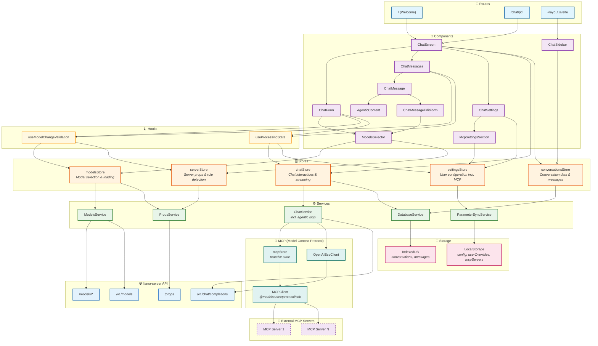

```mermaid
flowchart TB
    subgraph Routes["📍 Routes"]
        R1["/ (Welcome)"]
        R2["/chat/[id]"]
        RL["+layout.svelte"]
    end

    subgraph Components["🧩 Components"]
        C_Sidebar["ChatSidebar"]
        C_Screen["ChatScreen"]
        C_Form["ChatForm"]
        C_Messages["ChatMessages"]
        C_Message["ChatMessage"]
        C_AgenticContent["AgenticContent"]
        C_MessageEditForm["ChatMessageEditForm"]
        C_ModelsSelector["ModelsSelector"]
        C_Settings["ChatSettings"]
        C_McpSettings["McpSettingsSection"]
    end

    subgraph Hooks["🪝 Hooks"]
        H1["useModelChangeValidation"]
        H2["useProcessingState"]
    end

    subgraph Stores["🗄️ Stores"]
        S1["chatStore<br/><i>Chat interactions & streaming</i>"]
        S2["conversationsStore<br/><i>Conversation data & messages</i>"]
        S3["modelsStore<br/><i>Model selection & loading</i>"]
        S4["serverStore<br/><i>Server props & role detection</i>"]
        S5["settingsStore<br/><i>User configuration incl. MCP</i>"]
    end

    subgraph Services["⚙️ Services"]
        SV1["ChatService<br/><i>incl. agentic loop</i>"]
        SV2["ModelsService"]
        SV3["PropsService"]
        SV4["DatabaseService"]
        SV5["ParameterSyncService"]
    end

    subgraph MCP["🔧 MCP (Model Context Protocol)"]
        MCP1["MCPClient<br/><i>@modelcontextprotocol/sdk</i>"]
        MCP2["mcpStore<br/><i>reactive state</i>"]
        MCP3["OpenAISseClient"]
    end

    subgraph Storage["💾 Storage"]
        ST1["IndexedDB<br/><i>conversations, messages</i>"]
        ST2["LocalStorage<br/><i>config, userOverrides, mcpServers</i>"]
    end

    subgraph APIs["🌐 llama-server API"]
        API1["/v1/chat/completions"]
        API2["/props"]
        API3["/models/*"]
        API4["/v1/models"]
    end

    subgraph ExternalMCP["🔌 External MCP Servers"]
        EXT1["MCP Server 1"]
        EXT2["MCP Server N"]
    end

    %% Routes → Components
    R1 & R2 --> C_Screen
    RL --> C_Sidebar

    %% Component hierarchy
    C_Screen --> C_Form & C_Messages & C_Settings
    C_Messages --> C_Message
    C_Message --> C_AgenticContent
    C_Message --> C_MessageEditForm
    C_Form & C_MessageEditForm --> C_ModelsSelector
    C_Settings --> C_McpSettings

    %% Components → Hooks → Stores
    C_Form & C_Messages --> H1 & H2
    H1 --> S3 & S4
    H2 --> S1 & S5

    %% Components → Stores
    C_Screen --> S1 & S2
    C_Sidebar --> S2
    C_ModelsSelector --> S3 & S4
    C_Settings --> S5
    C_McpSettings --> S5

    %% Stores → Services
    S1 --> SV1 & SV4
    S2 --> SV4
    S3 --> SV2 & SV3
    S4 --> SV3
    S5 --> SV5

    %% ChatService → MCP (Agentic Mode)
    SV1 --> MCP2
    MCP2 --> MCP1
    SV1 --> MCP3
    MCP3 --> API1

    %% Services → Storage
    SV4 --> ST1
    SV5 --> ST2

    %% Services → APIs
    SV1 --> API1
    SV2 --> API3 & API4
    SV3 --> API2

    %% MCP → External Servers
    MCP1 --> EXT1 & EXT2

    %% Styling
    classDef routeStyle fill:#e1f5fe,stroke:#01579b,stroke-width:2px
    classDef componentStyle fill:#f3e5f5,stroke:#7b1fa2,stroke-width:2px
    classDef hookStyle fill:#fff8e1,stroke:#ff8f00,stroke-width:2px
    classDef storeStyle fill:#fff3e0,stroke:#e65100,stroke-width:2px
    classDef serviceStyle fill:#e8f5e9,stroke:#2e7d32,stroke-width:2px
    classDef storageStyle fill:#fce4ec,stroke:#c2185b,stroke-width:2px
    classDef apiStyle fill:#e3f2fd,stroke:#1565c0,stroke-width:2px
    classDef mcpStyle fill:#e0f2f1,stroke:#00695c,stroke-width:2px
    classDef externalStyle fill:#f3e5f5,stroke:#6a1b9a,stroke-width:2px,stroke-dasharray: 5 5

    class R1,R2,RL routeStyle
    class C_Sidebar,C_Screen,C_Form,C_Messages,C_Message,C_AgenticContent,C_MessageEditForm,C_ModelsSelector,C_Settings,C_McpSettings componentStyle
    class H1,H2 hookStyle
    class S1,S2,S3,S4,S5 storeStyle
    class SV1,SV2,SV3,SV4,SV5 serviceStyle
    class ST1,ST2 storageStyle
    class API1,API2,API3,API4 apiStyle
    class MCP1,MCP2,MCP3 mcpStyle
    class EXT1,EXT2 externalStyle
```
