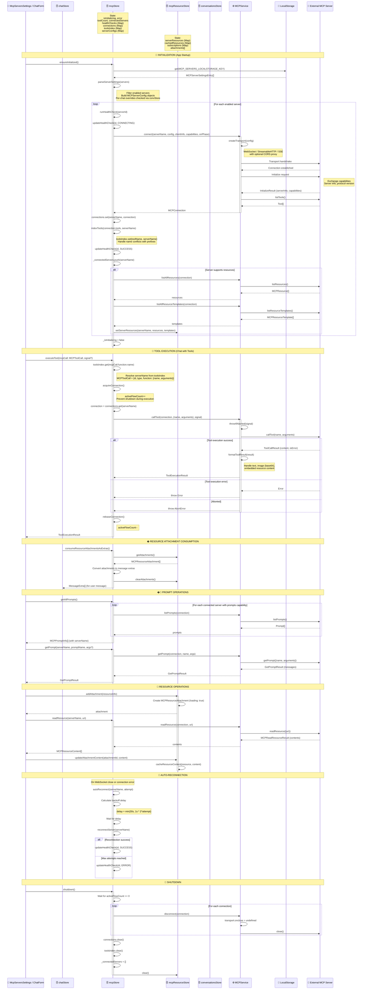

```mermaid
sequenceDiagram
    participant UI as 🧩 McpServersSettings / ChatForm
    participant chatStore as 🗄️ chatStore
    participant mcpStore as 🗄️ mcpStore
    participant mcpResStore as 🗄️ mcpResourceStore
    participant convStore as 🗄️ conversationsStore
    participant MCPSvc as ⚙️ MCPService
    participant LS as 💾 LocalStorage
    participant ExtMCP as 🔌 External MCP Server

    Note over mcpStore: State:<br/>isInitializing, error<br/>toolCount, connectedServers<br/>healthChecks (Map)<br/>connections (Map)<br/>toolsIndex (Map)<br/>serverConfigs (Map)

    Note over mcpResStore: State:<br/>serverResources (Map)<br/>cachedResources (Map)<br/>subscriptions (Map)<br/>attachments[]

    %% ═══════════════════════════════════════════════════════════════════════════
    Note over UI,ExtMCP: 🚀 INITIALIZATION (App Startup)
    %% ═══════════════════════════════════════════════════════════════════════════

    UI->>mcpStore: ensureInitialized()
    activate mcpStore

    mcpStore->>LS: get(MCP_SERVERS_LOCALSTORAGE_KEY)
    LS-->>mcpStore: MCPServerSettingsEntry[]

    mcpStore->>mcpStore: parseServerSettings(servers)
    Note right of mcpStore: Filter enabled servers<br/>Build MCPServerConfig objects<br/>Per-chat overrides checked via convStore

    loop For each enabled server
        mcpStore->>mcpStore: runHealthCheck(serverId)
        mcpStore->>mcpStore: updateHealthCheck(id, CONNECTING)
        
        mcpStore->>MCPSvc: connect(serverName, config, clientInfo, capabilities, onPhase)
        activate MCPSvc

        MCPSvc->>MCPSvc: createTransport(config)
        Note right of MCPSvc: WebSocket / StreamableHTTP / SSE<br/>with optional CORS proxy

        MCPSvc->>ExtMCP: Transport handshake
        ExtMCP-->>MCPSvc: Connection established

        MCPSvc->>ExtMCP: Initialize request
        Note right of ExtMCP: Exchange capabilities<br/>Server info, protocol version

        ExtMCP-->>MCPSvc: InitializeResult (serverInfo, capabilities)

        MCPSvc->>ExtMCP: listTools()
        ExtMCP-->>MCPSvc: Tool[]

        MCPSvc-->>mcpStore: MCPConnection
        deactivate MCPSvc

        mcpStore->>mcpStore: connections.set(serverName, connection)
        mcpStore->>mcpStore: indexTools(connection.tools, serverName)
        Note right of mcpStore: toolsIndex.set(toolName, serverName)<br/>Handle name conflicts with prefixes

        mcpStore->>mcpStore: updateHealthCheck(id, SUCCESS)
        mcpStore->>mcpStore: _connectedServers.push(serverName)

        alt Server supports resources
            mcpStore->>MCPSvc: listAllResources(connection)
            MCPSvc->>ExtMCP: listResources()
            ExtMCP-->>MCPSvc: MCPResource[]
            MCPSvc-->>mcpStore: resources

            mcpStore->>MCPSvc: listAllResourceTemplates(connection)
            MCPSvc->>ExtMCP: listResourceTemplates()
            ExtMCP-->>MCPSvc: MCPResourceTemplate[]
            MCPSvc-->>mcpStore: templates

            mcpStore->>mcpResStore: setServerResources(serverName, resources, templates)
        end
    end

    mcpStore->>mcpStore: _isInitializing = false
    deactivate mcpStore

    %% ═══════════════════════════════════════════════════════════════════════════
    Note over UI,ExtMCP: 🔧 TOOL EXECUTION (Chat with Tools)
    %% ═══════════════════════════════════════════════════════════════════════════

    UI->>mcpStore: executeTool(mcpCall: MCPToolCall, signal?)
    activate mcpStore

    mcpStore->>mcpStore: toolsIndex.get(mcpCall.function.name)
    Note right of mcpStore: Resolve serverName from toolsIndex<br/>MCPToolCall = {id, type, function: {name, arguments}}

    mcpStore->>mcpStore: acquireConnection()
    Note right of mcpStore: activeFlowCount++<br/>Prevent shutdown during execution

    mcpStore->>mcpStore: connection = connections.get(serverName)

    mcpStore->>MCPSvc: callTool(connection, {name, arguments}, signal)
    activate MCPSvc

    MCPSvc->>MCPSvc: throwIfAborted(signal)
    MCPSvc->>ExtMCP: callTool(name, arguments)

    alt Tool execution success
        ExtMCP-->>MCPSvc: ToolCallResult (content, isError)
        MCPSvc->>MCPSvc: formatToolResult(result)
        Note right of MCPSvc: Handle text, image (base64),<br/>embedded resource content
        MCPSvc-->>mcpStore: ToolExecutionResult
    else Tool execution error
        ExtMCP-->>MCPSvc: Error
        MCPSvc-->>mcpStore: throw Error
    else Aborted
        MCPSvc-->>mcpStore: throw AbortError
    end

    deactivate MCPSvc

    mcpStore->>mcpStore: releaseConnection()
    Note right of mcpStore: activeFlowCount--

    mcpStore-->>UI: ToolExecutionResult
    deactivate mcpStore

    %% ═══════════════════════════════════════════════════════════════════════════
    Note over UI,ExtMCP: � RESOURCE ATTACHMENT CONSUMPTION
    %% ═══════════════════════════════════════════════════════════════════════════

    chatStore->>mcpStore: consumeResourceAttachmentsAsExtras()
    activate mcpStore
    mcpStore->>mcpResStore: getAttachments()
    mcpResStore-->>mcpStore: MCPResourceAttachment[]
    mcpStore->>mcpStore: Convert attachments to message extras
    mcpStore->>mcpResStore: clearAttachments()
    mcpStore-->>chatStore: MessageExtra[] (for user message)
    deactivate mcpStore

    %% ═══════════════════════════════════════════════════════════════════════════
    Note over UI,ExtMCP: �📝 PROMPT OPERATIONS
    %% ═══════════════════════════════════════════════════════════════════════════

    UI->>mcpStore: getAllPrompts()
    activate mcpStore

    loop For each connected server with prompts capability
        mcpStore->>MCPSvc: listPrompts(connection)
        MCPSvc->>ExtMCP: listPrompts()
        ExtMCP-->>MCPSvc: Prompt[]
        MCPSvc-->>mcpStore: prompts
    end

    mcpStore-->>UI: MCPPromptInfo[] (with serverName)
    deactivate mcpStore

    UI->>mcpStore: getPrompt(serverName, promptName, args?)
    activate mcpStore

    mcpStore->>MCPSvc: getPrompt(connection, name, args)
    MCPSvc->>ExtMCP: getPrompt({name, arguments})
    ExtMCP-->>MCPSvc: GetPromptResult (messages)
    MCPSvc-->>mcpStore: GetPromptResult

    mcpStore-->>UI: GetPromptResult
    deactivate mcpStore

    %% ═══════════════════════════════════════════════════════════════════════════
    Note over UI,ExtMCP: 📁 RESOURCE OPERATIONS
    %% ═══════════════════════════════════════════════════════════════════════════

    UI->>mcpResStore: addAttachment(resourceInfo)
    activate mcpResStore
    mcpResStore->>mcpResStore: Create MCPResourceAttachment (loading: true)
    mcpResStore-->>UI: attachment

    UI->>mcpStore: readResource(serverName, uri)
    activate mcpStore

    mcpStore->>MCPSvc: readResource(connection, uri)
    MCPSvc->>ExtMCP: readResource({uri})
    ExtMCP-->>MCPSvc: MCPReadResourceResult (contents)
    MCPSvc-->>mcpStore: contents

    mcpStore-->>UI: MCPResourceContent[]
    deactivate mcpStore

    UI->>mcpResStore: updateAttachmentContent(attachmentId, content)
    mcpResStore->>mcpResStore: cacheResourceContent(resource, content)
    deactivate mcpResStore

    %% ═══════════════════════════════════════════════════════════════════════════
    Note over UI,ExtMCP: 🔄 AUTO-RECONNECTION
    %% ═══════════════════════════════════════════════════════════════════════════

    Note over mcpStore: On WebSocket close or connection error:
    mcpStore->>mcpStore: autoReconnect(serverName, attempt)
    activate mcpStore

    mcpStore->>mcpStore: Calculate backoff delay
    Note right of mcpStore: delay = min(30s, 1s * 2^attempt)

    mcpStore->>mcpStore: Wait for delay
    mcpStore->>mcpStore: reconnectServer(serverName)

    alt Reconnection success
        mcpStore->>mcpStore: updateHealthCheck(id, SUCCESS)
    else Max attempts reached
        mcpStore->>mcpStore: updateHealthCheck(id, ERROR)
    end
    deactivate mcpStore

    %% ═══════════════════════════════════════════════════════════════════════════
    Note over UI,ExtMCP: 🛑 SHUTDOWN
    %% ═══════════════════════════════════════════════════════════════════════════

    UI->>mcpStore: shutdown()
    activate mcpStore

    mcpStore->>mcpStore: Wait for activeFlowCount == 0

    loop For each connection
        mcpStore->>MCPSvc: disconnect(connection)
        MCPSvc->>MCPSvc: transport.onclose = undefined
        MCPSvc->>ExtMCP: close()
    end

    mcpStore->>mcpStore: connections.clear()
    mcpStore->>mcpStore: toolsIndex.clear()
    mcpStore->>mcpStore: _connectedServers = []

    mcpStore->>mcpResStore: clear()
    deactivate mcpStore
```
